

  

## Team Name

  

## Team Members
|  | 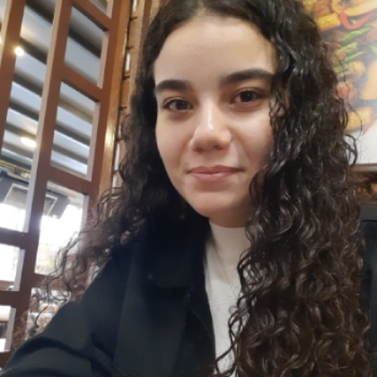 | 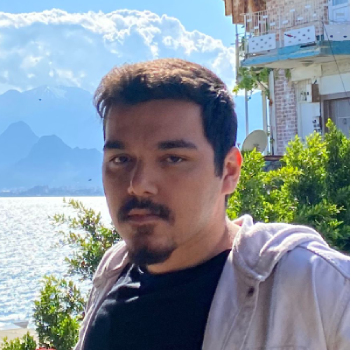 | 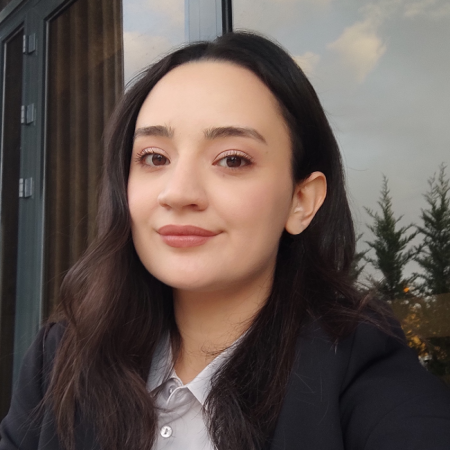 | 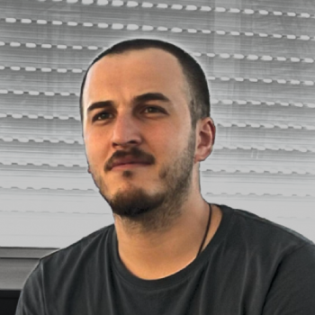 |
|:---------------------------------:|:-----------------------------------:|:-----------------------------------:|:-----------------------------------:|:-----------------------------------:|
| Kaan Avdan                       | Ece Koçak                       | Mustafa Toprak Sezgin                        | Ahsen Büşra Nur Güngör                       | Eşref Bakar                      |
| Scrum Master                     | Product Owner                   | Developer                                    |  Scrum Master & Developer                    | Developer                        |

## Game Name
NeuroDive

## Product Backlog List
- [U-43 Trello Sprint Board - 1](https://trello.com/b/Dkt6f6eS/1-sprint)
- [U-43 Trello Sprint Board - 2](https://trello.com/b/PlpaYQrY/2-sprint)
- [U-43 Trello Sprint Board - 3](https://trello.com/b/V8sbhcHa/sprint-3)

## Game Description
NeuroDive is an isometric puzzle/strategy game that blends science fiction and psychological thriller elements. The player infiltrates the minds of targeted individuals to extract valuable information. Throughout the game, the player explores various environments to gather clues about the target, manipulates the surroundings to create optimal conditions for a neural breach, and ultimately enters a surreal and hostile mental landscape to retrieve the data and complete the mission.

## Game Story
Criminal networks have gone dark, leaving no trace behind. The only way to reach their leaders is by secretly accessing the minds of their closest allies. We are the NeuroDive Agency. Using our advanced device, NeuroLance, we can enter a person’s mind without physical contact—but only when a rare mental state occurs: the activation of Zeta Waves. These waves appear under extreme stress, lowering mental defenses and opening a brief window into the subconscious. That’s when we dive in—extracting secrets to stop a global threat.

## Game Features
- 3D
- Singleplayer
- Adventure/Puzzle
- Interactive Quests
- Low-poly
- Offline

## Target Group
- 7 +
- Indie game lovers
- Exploration and Adventure Lovers

## Marketing Strategy
- We believe that our game will be a highly enjoyable game due to its adventurous and strategic structure. In line with these goals, we have decided to market our game on Steam with a price tag of $2.

## Links
- [Check Out Our Product]()
- [Watch Trailer on Youtube](https://www.youtube.com/watch?v=g_ZtNicsREc)

---
# **SPRINT 1**

   | 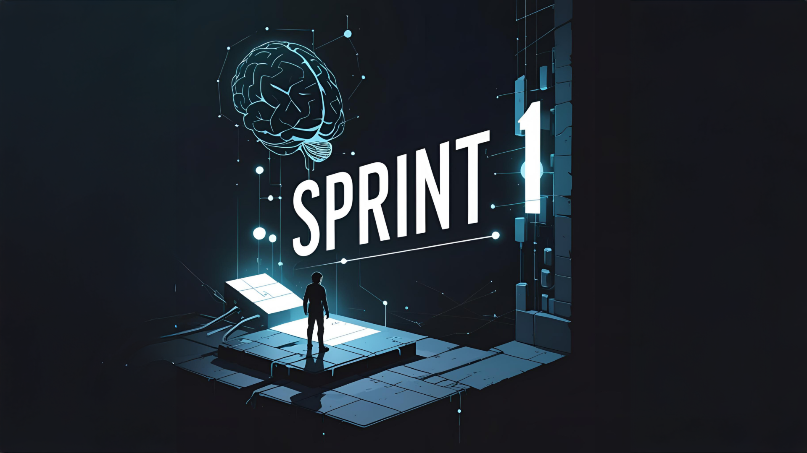 |
   |:---------------------------------:|

- It has been decided that the score evaluation for the sprint will be 10.
- Score completion logic: The backlog score that must be completed throughout the project is expected to be 30. The number of points to be completed for the first Sprint was determined as 10, and the target score was reached by obtaining 10 points.Each task in the first sprint was considered as 1 point.

### **Sprint 1 Notes**
- At the beginning of the first sprint the team has presented different ideas and decided the basic elements of the game.
- The tasks were decided afterwards.  

  **To Do List:**
- Programming the isometric camera controls
- Coding the character mechanics
- Coding the mini games
- Designing the main menu 

### **Sprint 1 Board**
   | 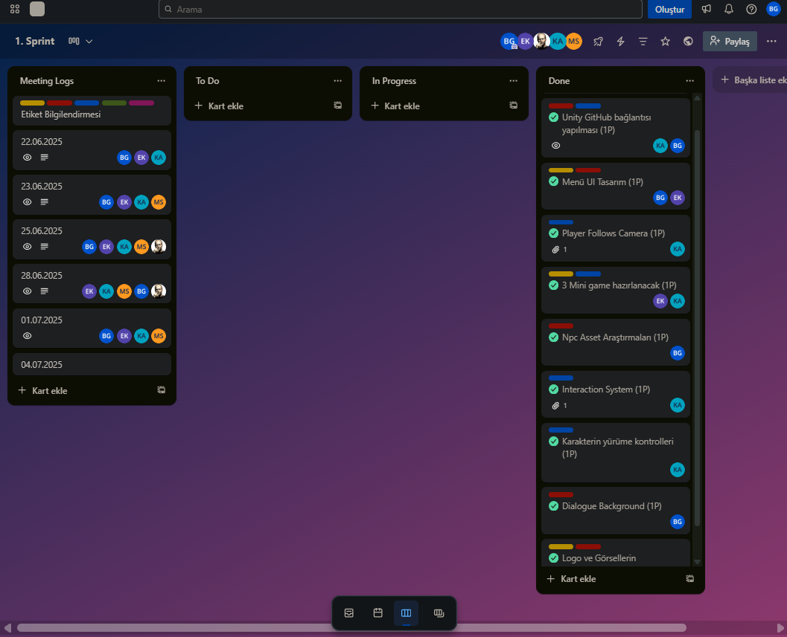 |
   |:---------------------------------:|
   | Sprint 1 board                         |

### **Daily Scrum**

* Daily scrum was held via WhatsApp and Google Meet. Google Meet meeting notes can be found on Trello as cards in the "Meeting Logs" list.

   | 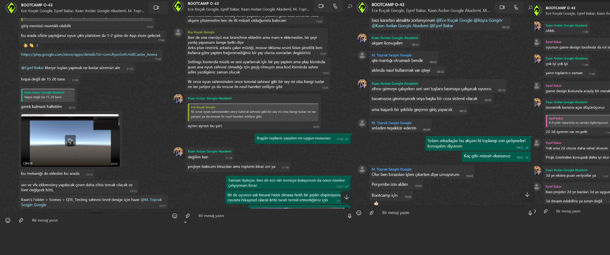 |
   |:---------------------------------:|
   | Initially, communication was established via WhatsApp, and WhatsApp was preferred for daily communication                         |

   | 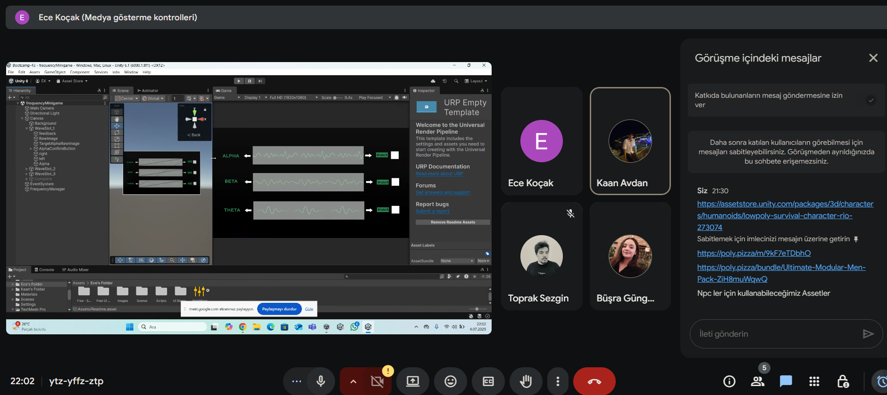 |
   |:---------------------------------:|
   | Google Meet was preferred for planning and collaborative work.                         |

   | 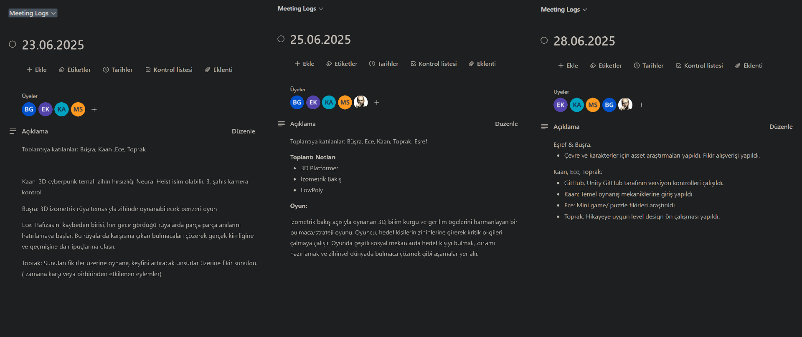 |
   |:---------------------------------:|
   | Recordings of Google Meet meetings can be found on Trello as cards in the "Meeting Logs" list                         |

 
### **Development Progress**
* 3 mini games were programmed in our game. Main Menu design was done.

   | 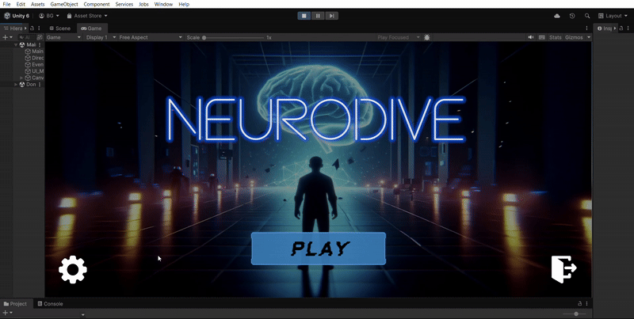 | 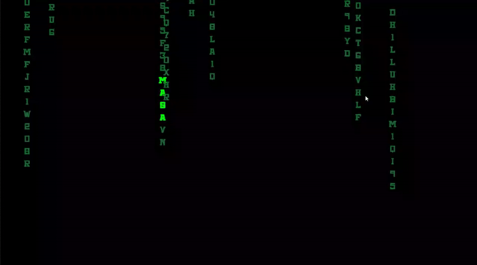 |
   |:---------------------------------:|:-----------------------------------:|
   | Main Menu Design                        | Minigame                     |

* Character movement mechanics and interaction system coded. Camera controls programmed.

   | 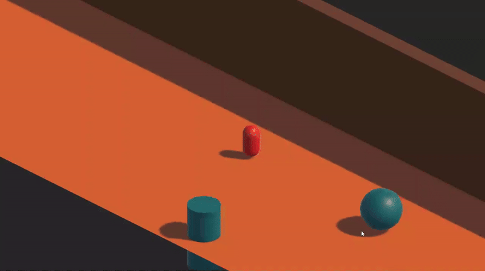 | 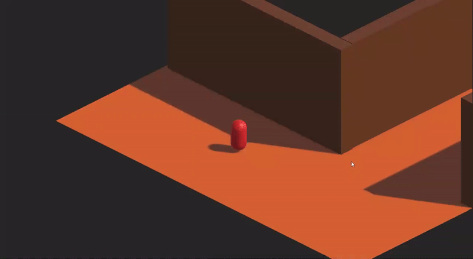 |
   |:---------------------------------:|:-----------------------------------:|
   | Interaction System                        | Camera Controls                         |

* The basic logic scheme of the game has been created.

   | 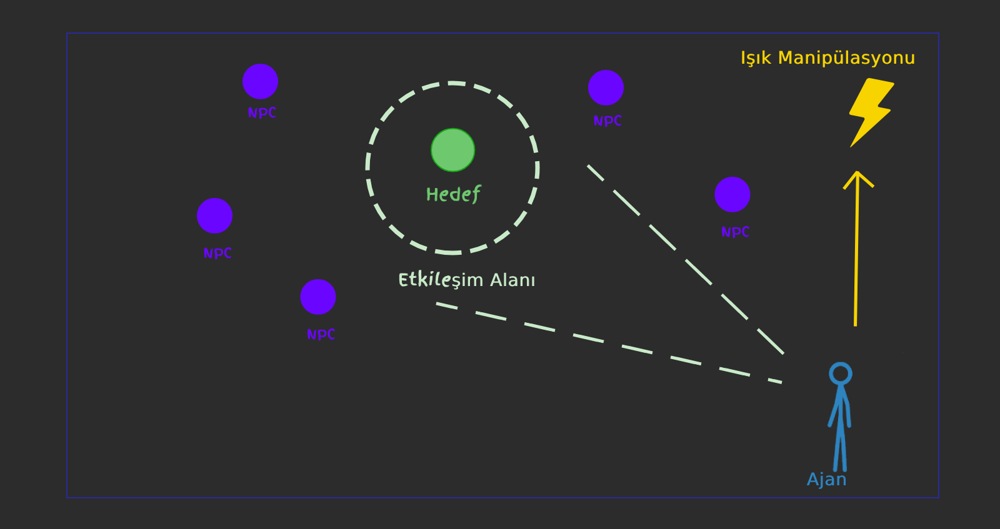 |
   |:---------------------------------:|
   | Logic Scheme                       |

* Work has begun on new mini games.

   | 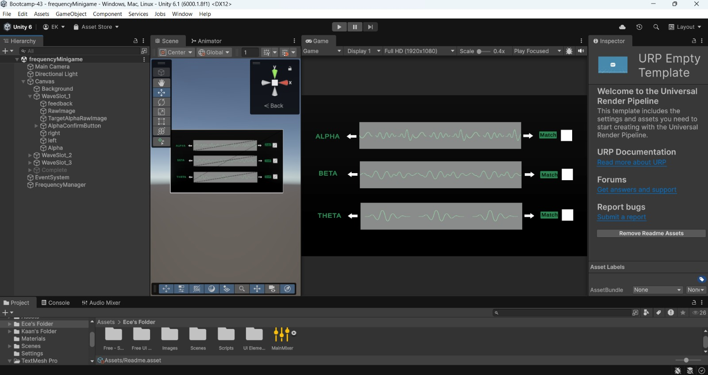 |
   |:---------------------------------:|
   | New Minigame Progress                        |

 ### **Sprint Review**
- At the end of Sprint 1, the team met and the Sprint was reviewed. The intended tasks have all been completed.
Sprint Review participants: Ahsen Büşra Nur Güngör, Kaan Avdan, Ece Koçak, Mustafa Toprak Sezgin, Eşref Bakar

 ### **Sprint Retrospective**
- The score for Sprint 1 is 10.
- It was decided that the map would be completed in Sprint 2.
- The character's mechanics were coded.
- The team discussed the next steps, and the tasks of completing the map and completing the cinematic images to be used at the beginning were added to the to-do list of the second sprint.
- It was decided that communication between team members would be increased in future sprints.

---
# **SPRINT 2**

   | 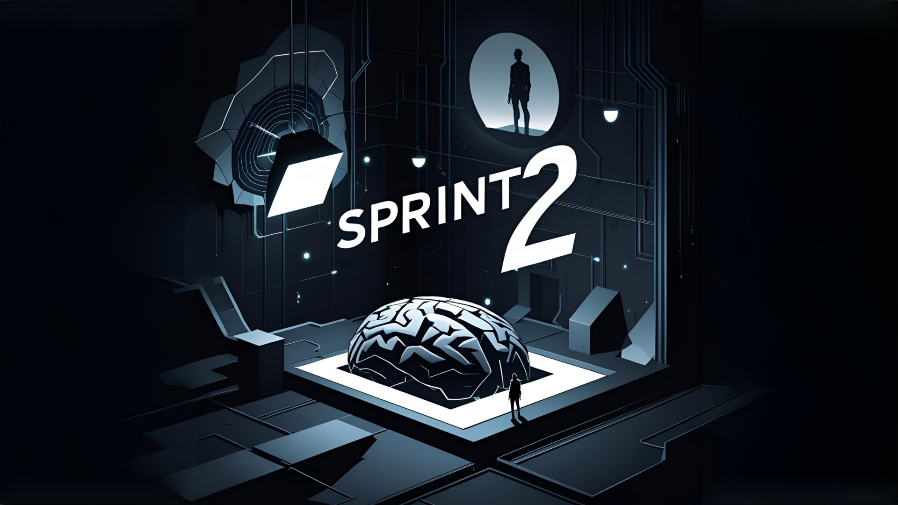 |
   |:---------------------------------:|

-Score completion logic: The number of points to be completed for the second Sprint was determined as 10, and the target score was reached by obtaining 10 points. Scoring was done according to the workload of the tasks.

### **Sprint 2 Notes**
- At the beginning of the second sprint the team has discussed which tasks will be completed in the second sprint.Tasks are distributed so as not to exceed the estimated number of points per sprint. 

  **To Do List:**
- Coding of target detection and randomization systems.
- Intramental level design.
- Designing the main character and integrating movement mechanisms into this character.
- Prototyping of extramental level design.
- Finding new assets for enviroment
- Writing the game's story and lore
- Preparing Game Design Document
   

### **Sprint 2 Board**
   | 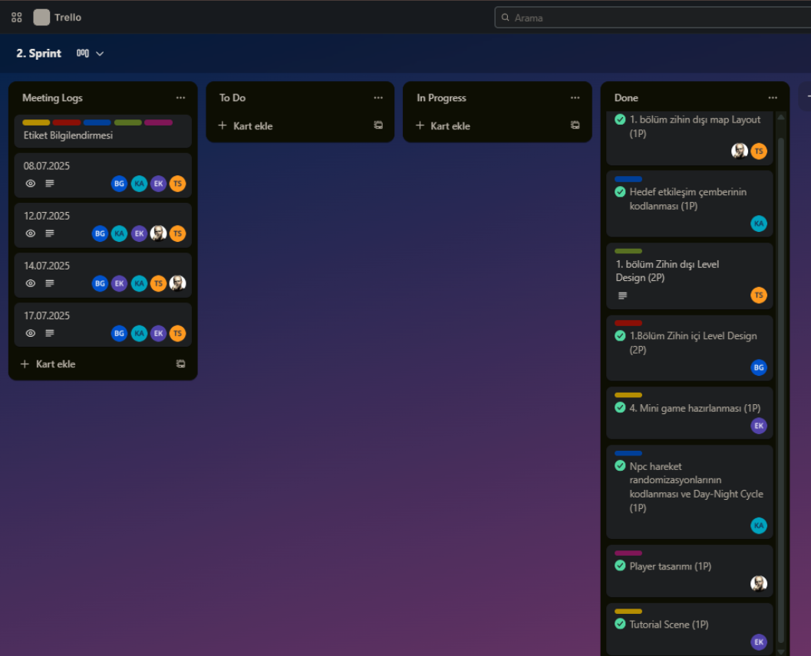 |
   |:---------------------------------:|
   | Sprint 2 board                         |

### **Daily Scrum**

* Daily scrum was held via WhatsApp and Google Meet. Google Meet meeting notes can be found on Trello as cards in the "Meeting Logs" list.

   | 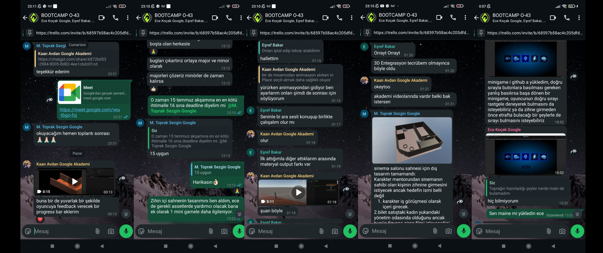 |
   |:---------------------------------:|
   | Initially, communication was established via WhatsApp, and WhatsApp was preferred for daily communication                         |

   | 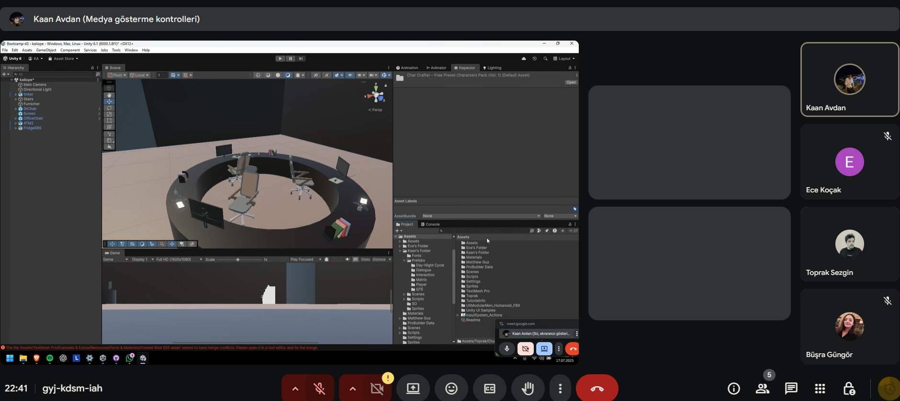 |
   |:---------------------------------:|
   | Google Meet was preferred for planning and collaborative work.                         |

   | 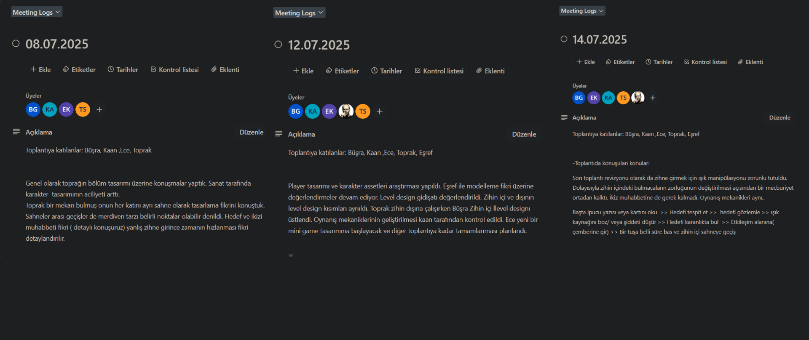 |
   |:---------------------------------:|
   | Recordings of Google Meet meetings can be found on Trello as cards in the "Meeting Logs" list                         |

 
### **Development Progress**
* The main character's enemy detection and interaction system has been developed. Prototypes for the Out of Mind stage have been prepared.

   | 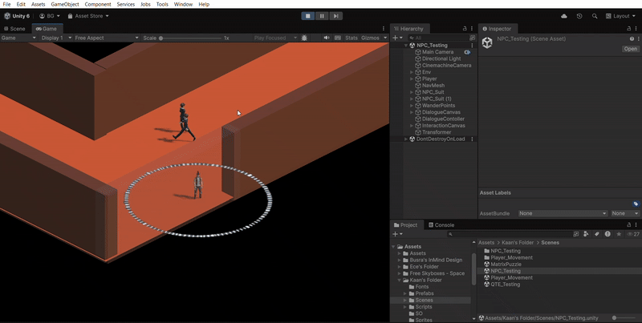 |  |
   |:---------------------------------:|:-----------------------------------:|
   | Target detection system                         | Out of Mind stage prototype                      |

* The animation and interaction system for the Inside the Mind stage has been coded. Level design for the Inside the Mind stage has been completed.

   | 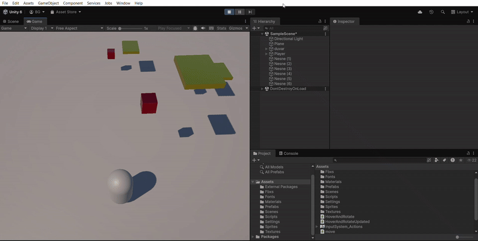 |  |
   |:---------------------------------:|:-----------------------------------:|
   | Inside the Mind animation and interaction testing                         | Inside the Mind level design                          |

* The fourth mini game has been completed.

   | 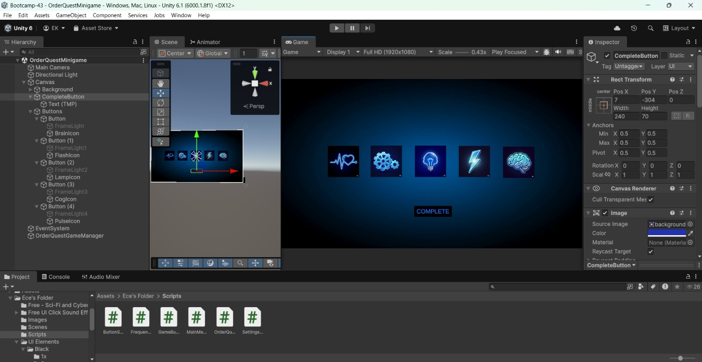 |
   |:---------------------------------:|
   | 4th mini game                      |

* The main character sketch prepared.

   | 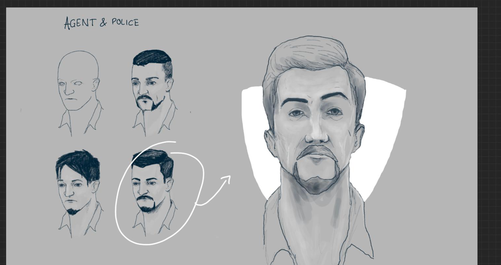 |
   |:---------------------------------:|
   | The main character sketch                       |

* The main character modelling has been done.

   | 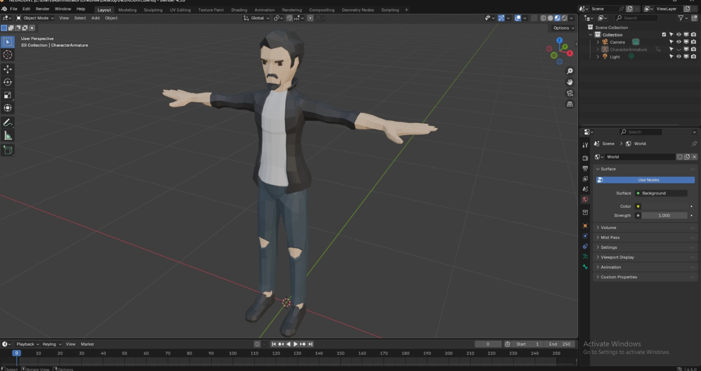 |
   |:---------------------------------:|
   | The main character modelling                       |

 ### **Sprint Review**
- The intended tasks have all been completed.
- The levels designed during the sprint were played by the entire team, and points for improvement were discussed before the third sprint.
- Main character design was finalized.
- It was decided to adjust the difficulty levels in the mini-games.
  
Sprint Review participants: Ahsen Büşra Nur Güngör, Kaan Avdan, Ece Koçak, Mustafa Toprak Sezgin, Eşref Bakar

 ### **Sprint Retrospective**
- The score achieved at the end of Sprint 2 was 10/10.
- The team is expected to improve overall performance in the next sprint.
- It was agreed to increase communication frequency compared to the previous sprint to ensure better coordination.

---
# **SPRINT 3**

   | 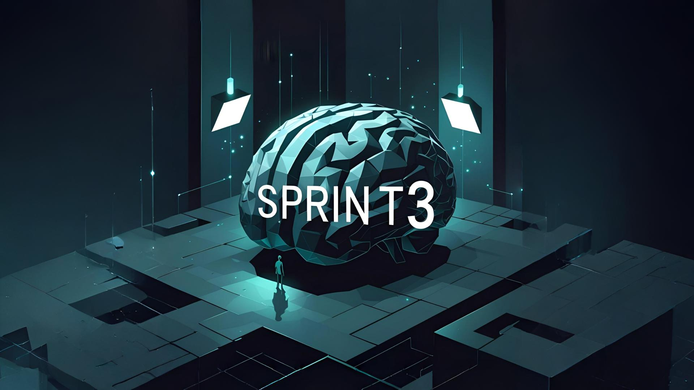 |
   |:---------------------------------:|

-Score Completion Logic: The total backlog score to be completed throughout the project was set at 30. Scoring was based on the workload of the tasks. For the third and final Sprint, the number of points to be completed was determined as 10. The target score of 30 was achieved by earning the full score.

### **Sprint 3 Notes**
-At the beginning of the third sprint, the team discussed the remaining tasks. Two team members, Büşra and Kaan, made plans to complete the game as a final product. 

  **To Do List:**
- ZENTRAX LABS Logo will be prepared.
- Loading Screen will be prepared
- Level Designs will be improved.
- A stopwatch system and in-game UI panels will be added
- In-game scene transition animation will be prepared.
- Music and Sound for the game and gameplay video will be created.
- The game will be tested to check for errors.
   

### **Sprint 3 Board**
   | 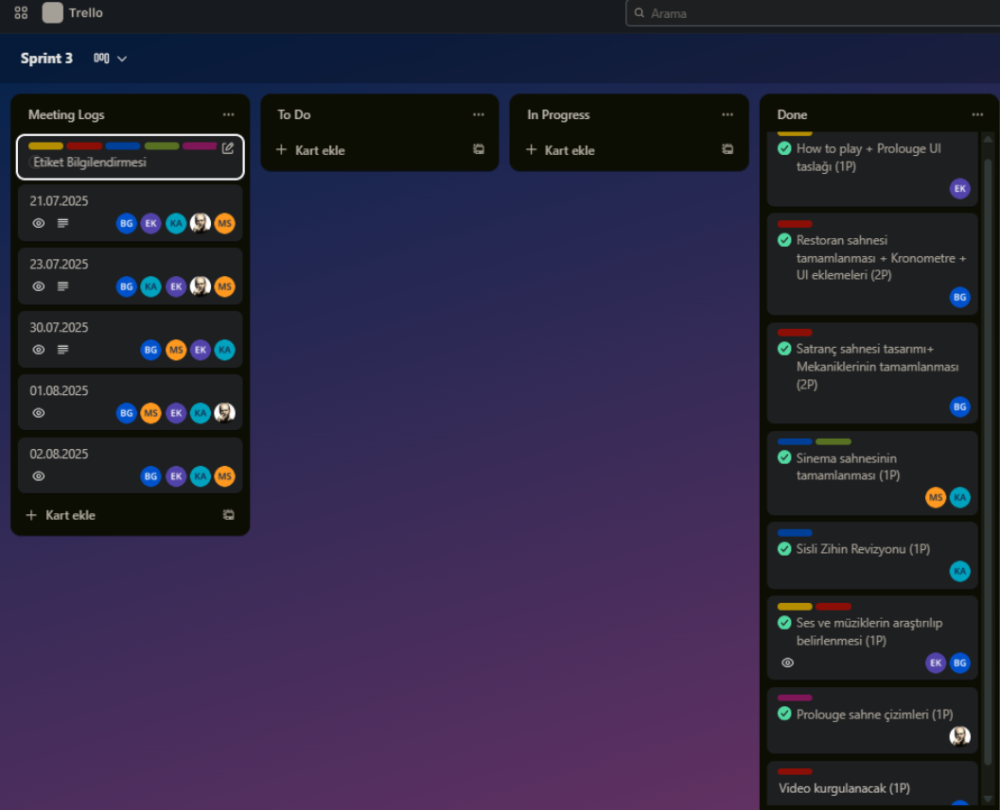 |
   |:---------------------------------:|
   | Sprint 3 board                         |

### **Daily Scrum**

* Daily scrum was held via WhatsApp and Google Meet. Google Meet meeting notes can be found on Trello as cards in the "Meeting Logs" list.

   | 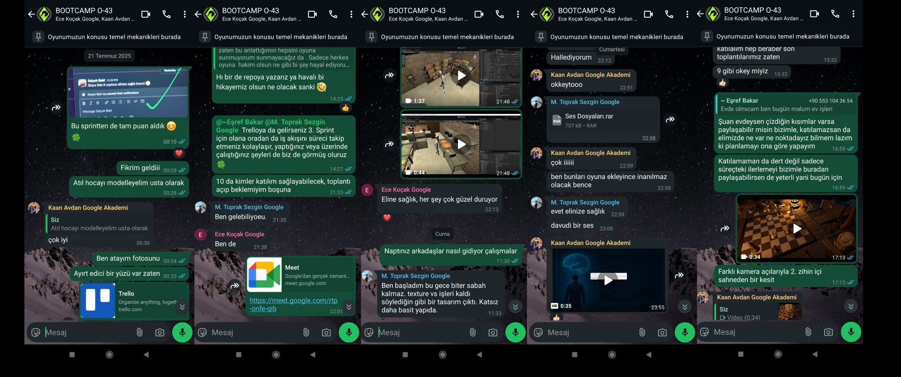 |
   |:---------------------------------:|
   | Initially, communication was established via WhatsApp, and WhatsApp was preferred for daily communication                         |

   | 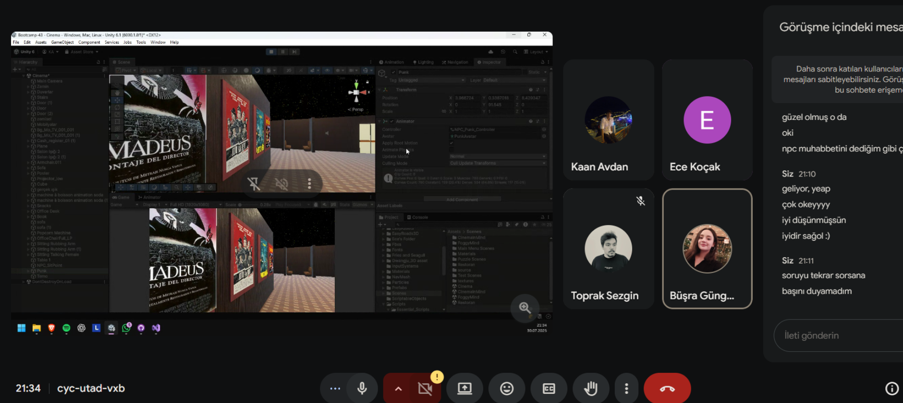 |
   |:---------------------------------:|
   | Google Meet was preferred for planning and collaborative work.                         |

   | 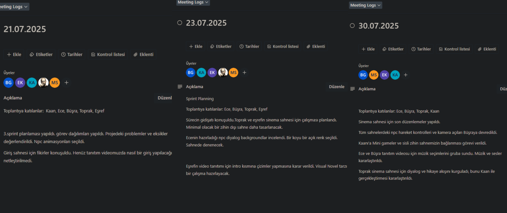 |
   |:---------------------------------:|
   | Recordings of Google Meet meetings can be found on Trello as cards in the "Meeting Logs" list                         |

 
### **Development Progress**
* NPC movement scenarios were created. Animations appropriate to the level and story design were added.

   |  |
   |:---------------------------------:|
   | NPC movements                         |

* Chapter 1: Out of Mind scene lighting manipulation mechanic was implemented and main character lighting controls were added.

   |  |
   |:---------------------------------:|
   | Lighting manipulation                          |

* The Inside the Mind level design and chess puzzle of the target in Chapter 1 have been created. 

   |  |
   |:---------------------------------:|
   | The Inside the Mind chess puzzle                         |

   | 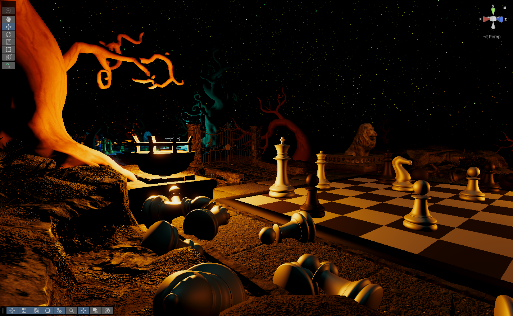 |
   |:---------------------------------:|
   | Chess board scene design                      |

  

   | 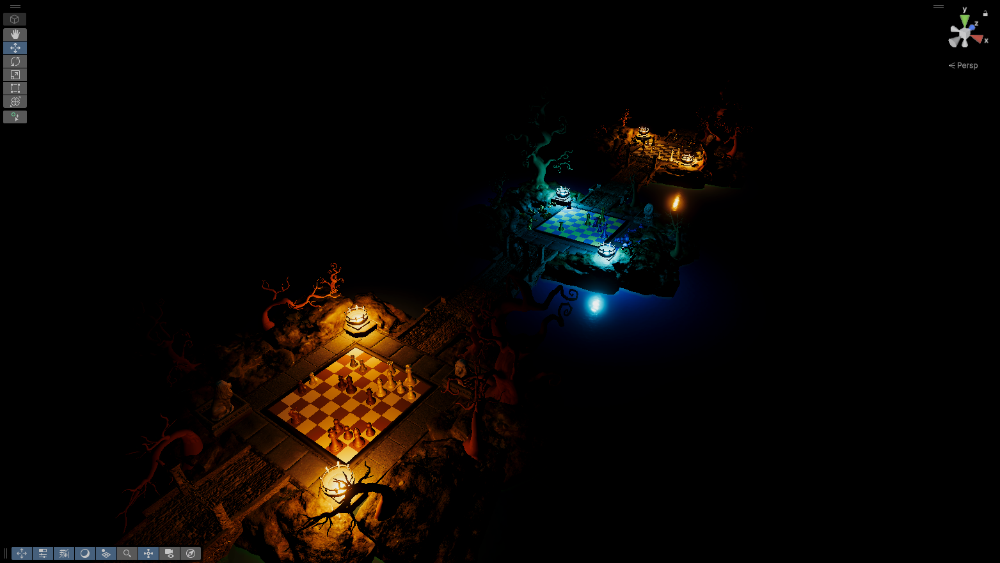 |
   |:---------------------------------:|
   | Chess board scene design                    |

* Improved the target’s mind scene in Chapter 2 by connecting mini-games to objects within the mind.

   |  |
   |:---------------------------------:|
   | The Inside the Mind level design in chapter 2                        |

* Our Chapter 1 intro scene and interaction system info panel have been designed.

   | 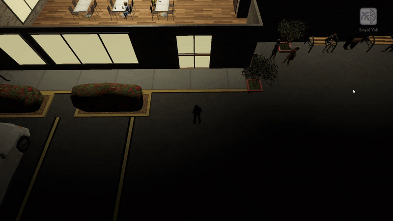 |
   |:---------------------------------:|
   | Interaction system info panel                        |

* The main menu design and interface have been updated.

   | 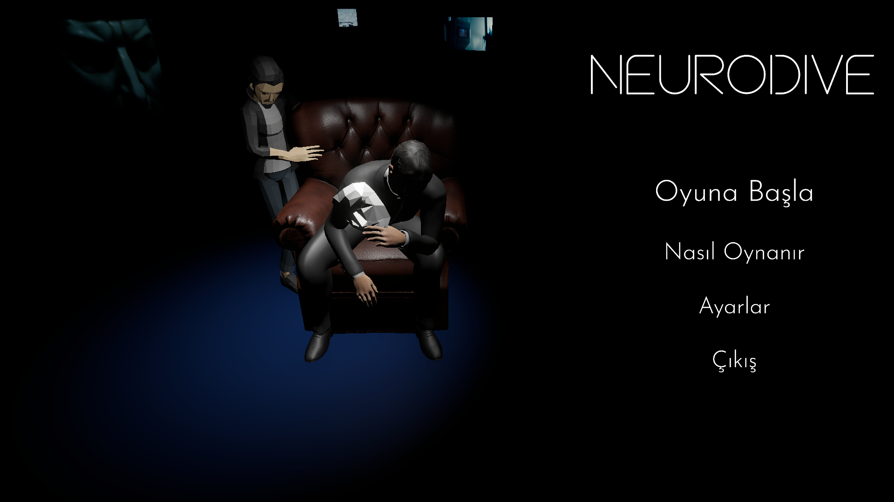 |
   |:---------------------------------:|
   | New Manin Menu                       |

  

 ### **Sprint Review**
 
- During the third sprint, the team focused on finalizing the project and delivering a complete, playable version of the game. Key accomplishments include:
- The main menu scene was successfully designed, offering a clean and intuitive UI.
- The game's introductory scene, including the information panel, was created in a visual novel style to introduce the narrative universe.
- Interaction systems were improved to allow meaningful player-object interactions.
- All previously developed chapters were connected to form a complete game flow.
- The game was finalized and delivered as a finished product.
- A total of 10 story points were completed during this sprint, reaching the overall target of 30 points across all sprints.
- At the end of this sprint, the game reached a presentable and functional final state.
  
  
Sprint Review participants: Ahsen Büşra Nur Güngör, Kaan Avdan, Ece Koçak, Mustafa Toprak Sezgin, Eşref Bakar

 ### **Sprint Retrospective**
 
- Solid groundwork from earlier sprints contributed to a smoother development process.
- Time management was less efficient than expected; last-minute adjustments were required to meet the sprint goals.
- Some visual design decisions could have benefited from more iteration and feedback rounds.
- The free [Assets](https://drive.google.com/file/d/1gZh-zUxGMBH_gdhk4ZkrKyXBcSwNHqTb/view?usp=drive_link) we used.
  
